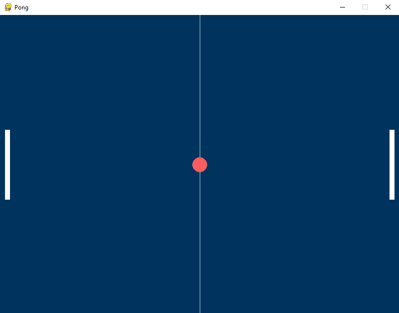

# Pong-Python-and-Pygame
!ping

Simple pong game made in Pygame
Made to be played with 2 players!

```
Player 1 (left) keys:
W = Up
S = Down

Player 2 (right) keys:
Arrow Up = Up
Arrow Down = Down
```

